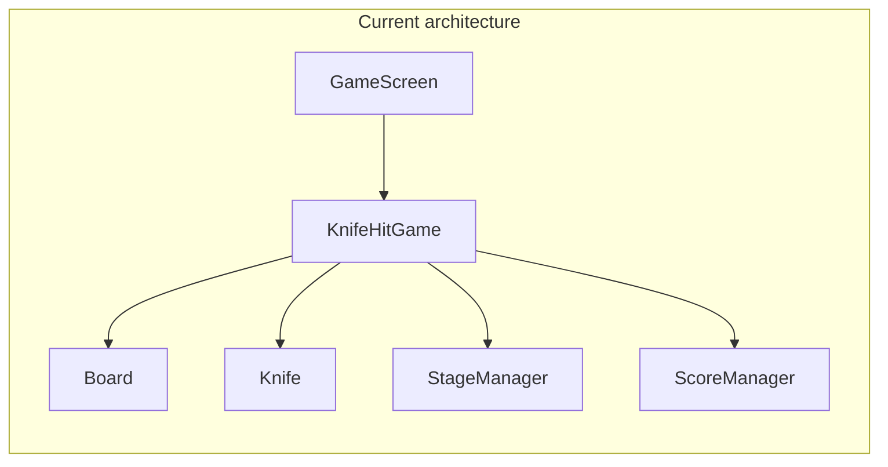
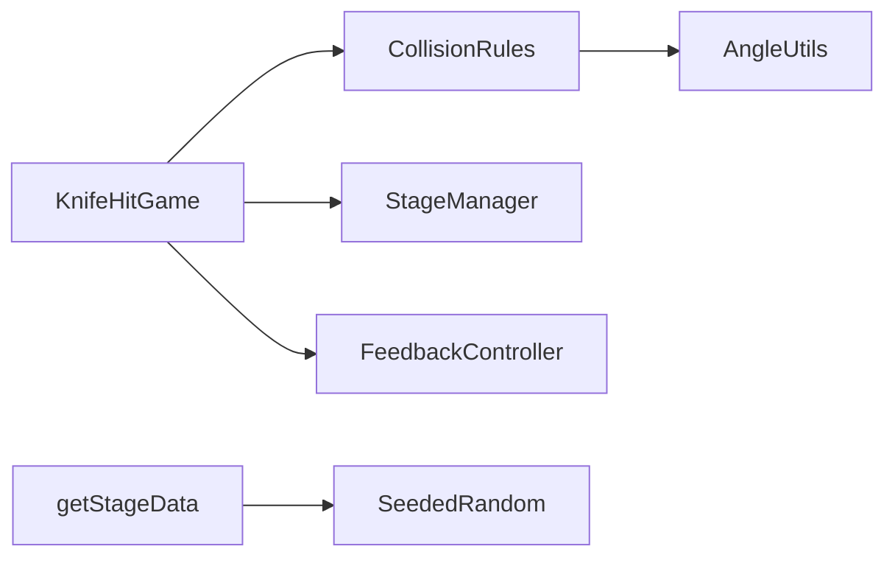

# Knife Hit — Full Improvement Roadmap

## Current state (baseline)

The game loop lives primarily in [`lib/game/knife_hit_game.dart`](lib/game/knife_hit_game.dart) (~960 lines). Stage rules are in [`lib/game/utils/stage_data.dart`](lib/game/utils/stage_data.dart). Persistence uses [`shared_preferences`](pubspec.yaml) via [`lib/game/managers/high_score_manager.dart`](lib/game/managers/high_score_manager.dart). There are no real game-logic tests ([`test/widget_test.dart`](test/widget_test.dart) is a placeholder).

Target architecture (by end of Phase 1): thin orchestrator + testable rules.

---

## Phase 1 — Logic hardening (foundation)

Goal: make rules correct, predictable, and testable before adding features.

### 1.1 Extract pure game rules (new files)

Split logic out of `knife_hit_game.dart` to respect the 400-line file limit and enable unit tests.

- [`lib/game/utils/angle_utils.dart`](lib/game/utils/angle_utils.dart): `shortestAngleDiff`, `isAngleTooClose`, normalize to `[0, 2*pi)`
- [`lib/game/rules/collision_rules.dart`](lib/game/rules/collision_rules.dart): knife-vs-stuck collision, `effectiveMinAngle`, perfect-gap check, boss spike hit test
- [`lib/game/rules/stage_layout_rules.dart`](lib/game/rules/stage_layout_rules.dart): pre-stuck / apple / spike placement with shared gap constants

Move existing logic from `knife_hit_game.dart` (angle checks, collision block, and setup-stage placement) into these modules. Keep `KnifeHitGame` focused on Flame lifecycle, input, rendering, and rule calls.

### 1.2 Fix forced-stick (overshoot) policy

Problem: `_onKnifeHitBoard(forced: true)` currently calls `stageManager.knifeStuck()` and can complete a stage without skill or score.

Recommended behavior:

- On forced hit, do not increment `knivesStuck`
- Do not consume the throw (rollback or re-spawn same throw)
- Reset combo (same as now)
- Show floating text `"MISSED"` (no score)

This keeps `knivesThrown` and `knivesStuck` aligned and prevents accidental stage clears.

### 1.3 Seeded stage generation

Problem: [`getStageData(int stage)`](lib/game/utils/stage_data.dart) uses unseeded `Random()`, so the same stage number changes every run.

Change:

- Update to `getStageData(int stage, {int? seed})`
- Default to deterministic seed (example: `stage * 7919`) or pass seed from `StageManager`
- Use seeded random for spike positions, knife variance, burst flag, and theme selection

### 1.4 Stage rotation mode clarity

In [`lib/game/utils/stage_data.dart`](lib/game/utils/stage_data.dart), stages 5–8 do not produce a "reverse + direction changes" combo.

Recommended:

- Add a 4th outcome for both reverse and direction-changes (stage 9+)
- Document the rotation tier table at the top of `getStageData`

### 1.5 High-score UI accuracy

In `_triggerGameOver`, `gameOverIsNewHighScore` checks only score.

Update logic:

- Mark new best when `score > highScore` OR `stage > highStage`
- Compare before `saveIfBetter` mutates in-memory values

### 1.6 Unit tests

Add:

- [`test/game/angle_utils_test.dart`](test/game/angle_utils_test.dart)
- [`test/game/collision_rules_test.dart`](test/game/collision_rules_test.dart)
- [`test/game/stage_data_test.dart`](test/game/stage_data_test.dart)

Test cases:

- Angle wrap at `0 / 2*pi`
- Collision at exactly `minAngleBetweenKnives`
- Perfect-gap behavior with 1, 2, and N stuck knives
- Arc capacity: `(preStuck + knivesCount) * minAngle <= 2*pi`
- Seeded stage determinism: same stage => same output

Run: `flutter test`

### 1.7 Cleanup

- Remove dead `_isTooCloseToExisting`
- Remove unused HUD `stuck` variable

Phase 1 exit criteria:

- All tests green
- Forced-stick cannot complete stage
- Same stage number produces consistent layout

---

## Phase 2 — Feel and interactivity (moment-to-moment)

Goal: every throw feels responsive; near-wins and wins feel satisfying.

### 2.1 Feedback controller

Add [`lib/game/managers/feedback_controller.dart`](lib/game/managers/feedback_controller.dart):

- Wrap `HapticFeedback`
- Methods: `light()`, `medium()`, `heavy()`
- Trigger alongside existing audio events from `KnifeHitGame`

### 2.2 Near-miss detection

In collision rules, when angle diff is in `(effectiveMinAngle, effectiveMinAngle + 0.08)`:

- Do not trigger game over
- On successful stick, flag `wasNearMiss`
- Show amber board flash + `"CLOSE!"` floating text + medium haptic

### 2.3 Combo juice (visual + audio)

In [`lib/game/managers/score_manager.dart`](lib/game/managers/score_manager.dart), expose `comboTier` (every 3 knives).

Use it for:

- Floating text scale/color
- Audio intensity (pitch/volume variation if supported)
- Optional blade tint for high combo streaks

Design choice:

- Keep combo reset per stage (current behavior), or
- Add session combo (resets only on game over) for stronger retention

### 2.4 Perfect throw improvements

- Add "Clean Shot +2" for the first knife on empty board
- Add brief golden ring effect at stick position

### 2.5 Last-knife tension

When last knife launches:

- Brief slow-mo (~200ms)
- Stronger haptic + keep current "LAST KNIFE" signaling

### 2.6 Boss fairness telegraph

In [`lib/game/components/board.dart`](lib/game/components/board.dart) `triggerBossPhase()`:

- Add ~0.4s spike pulse/telegraph before speed escalation
- Sync with existing `"PHASE 2!"` floating text

Phase 2 exit criteria:

- Playtesters can clearly feel differences between stick, perfect, near-miss, and fail states

---

## Phase 3 — Depth and retention (meta-game)

Goal: give players reasons to return daily and continue long-term.

### 3.1 Progress persistence layer

Add [`lib/game/managers/progress_manager.dart`](lib/game/managers/progress_manager.dart) for:

- `total_apples_lifetime`
- `unlocked_knife_ids`
- `milestones_unlocked`
- `daily_challenge_date`, `daily_best_score`
- `last_played_stage` (optional continue support)

Load in home screen init, save on stage complete/game over.

### 3.2 Milestones / achievements

Add:

- [`lib/data/mocks/milestones.dart`](lib/data/mocks/milestones.dart)
- [`lib/game/managers/milestone_manager.dart`](lib/game/managers/milestone_manager.dart)
- [`lib/screens/widgets/milestone_toast.dart`](lib/screens/widgets/milestone_toast.dart)

Example milestones:

- `first_boss`
- `apples_10`
- `perfect_5_run`
- `stage_10`
- `combo_9`

### 3.3 Knife skins (cosmetic)

Add:

- [`lib/data/mocks/knife_skins.dart`](lib/data/mocks/knife_skins.dart)
- Skin picker on [`lib/screens/home_screen.dart`](lib/screens/home_screen.dart)

Pass selected skin to `GameScreen` and into `Knife`/`StuckKnife` render paths.

### 3.4 Daily challenge

Add generator:

- [`lib/data/generators/daily_challenge_generator.dart`](lib/data/generators/daily_challenge_generator.dart)

Rules:

- Seed = `yyyyMMdd`
- Fixed daily board
- Score-only mode from home screen
- Persist daily best score

### 3.5 Session goals

Add goals list:

- [`lib/data/mocks/session_goals.dart`](lib/data/mocks/session_goals.dart)

Sample goals:

- Collect 3 apples
- Get 2 perfect throws
- Clear stage without spike hit

Show progress in HUD and reward bonus score on completion.

### 3.6 Continue / revive (optional)

Allow one continue per run:

- Spend 5 lifetime apples OR use reward callback placeholder
- Restore same stage/score/board snapshot

Add snapshot model:

- [`lib/game/models/stage_snapshot.dart`](lib/game/models/stage_snapshot.dart)

Phase 3 exit criteria:

- Home screen shows milestones/skins/daily entry
- At least 3 milestones achievable per session

---

## Phase 4 — Polish and product quality

Goal: ship-ready UX and maintainability.

### 4.1 Refactor `knife_hit_game.dart`

Split HUD/render out to:

- [`lib/game/components/hud_overlay.dart`](lib/game/components/hud_overlay.dart) (or Flame HUD component)

Keep `KnifeHitGame` under ~250 lines.

### 4.2 Settings screen

Add [`lib/screens/settings_screen.dart`](lib/screens/settings_screen.dart):

- Sound on/off
- Haptics on/off
- Difficulty modes (Easy/Normal/Hard) via collision multiplier

### 4.3 Difficulty-specific high scores

Extend [`lib/game/managers/high_score_manager.dart`](lib/game/managers/high_score_manager.dart) keys:

- `high_score_easy`, `high_score_normal`, `high_score_hard`

### 4.4 Stage complete / game over UX

- Upgrade [`lib/screens/stage_complete_screen.dart`](lib/screens/stage_complete_screen.dart): goal progress, milestone summary, combo best
- Upgrade [`lib/screens/game_over_screen.dart`](lib/screens/game_over_screen.dart): continue button + optional share action

### 4.5 Integration smoke test

Add:

- [`integration_test/app_test.dart`](integration_test/app_test.dart)

Minimum flow:

- Launch app
- Enter game
- Verify core navigation path

Phase 4 exit criteria:

- Settings persist
- No file exceeds size constraints
- `flutter test` runs clean

---

## Recommended sprint order

- Sprint 1: complete Phase 1 (2–3 days)
- Sprint 2: complete Phase 2 (2–3 days)
- Sprint 3: complete Phase 3.1–3.3 (3–4 days)
- Sprint 4: complete Phase 3.4–3.6 and Phase 4 (3–5 days)

Rule: do not begin Phase 3 before Phase 1 test pass.

---

## Dependencies (later phases only)

- `share_plus` (Phase 4, optional sharing)
- `integration_test` (Phase 4 dev dependency)

No extra dependency needed for haptics or seeded stage logic.

---

## Risk notes

- `knife_hit_game.dart` size and mixed responsibilities increase bug risk; split early.
- Stage transition currently recreates `GameScreen`; continue/revive must choose between persistent instance or full snapshot restore.
- Daily seed and normal-stage seed must remain separate.

---

## Success metrics

- Zero soft-locks in stress tests after forced-stick fix
- Test coverage for angle/collision/stage-capacity rules
- Session length increase after Phase 2/3 features
- Daily mode usage visible from persisted challenge keys
