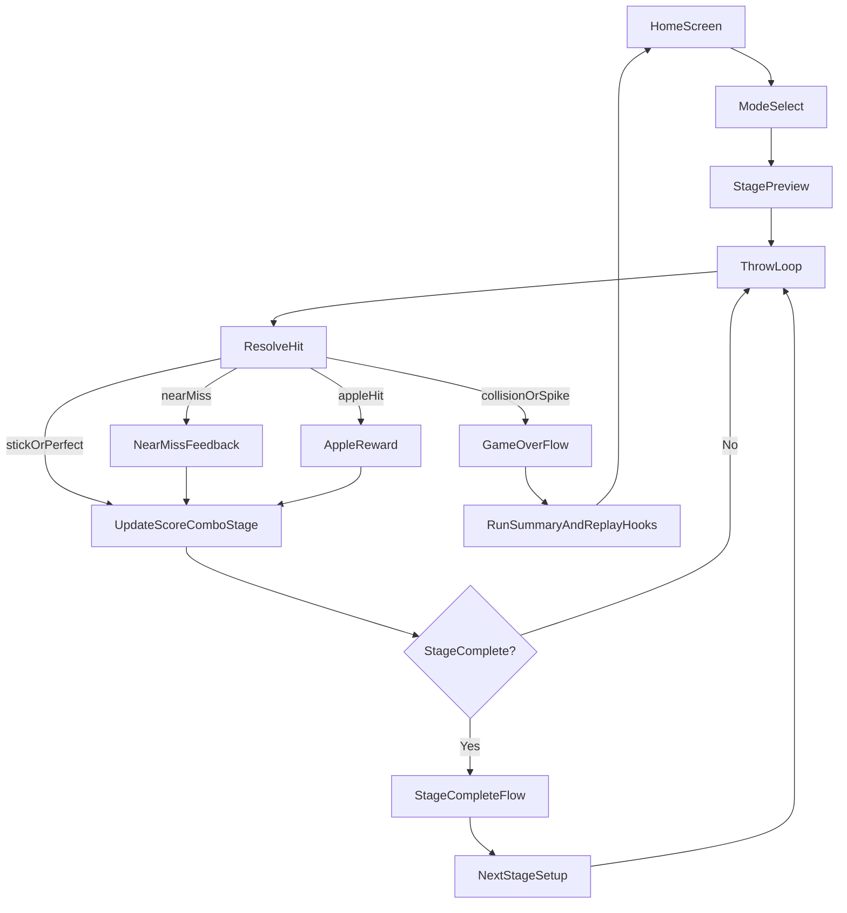

# Perfect Knife Hit Game Flow Plan

## Goals
- Build a deterministic, fair, and readable core loop.
- Maximize player feel using clear feedback and tension pacing.
- Add retention systems (daily, milestones, skins, goals) without harming core gameplay.
- Refactor architecture so core rules are testable and maintainable.

## Target Player Experience
- Fast entry: player reaches first throw in under 5 seconds.
- Every throw has an obvious result: clean, perfect, near-miss, apple, or fail reason.
- Difficulty rises predictably and feels learnable.
- End-of-run always gives a reason to replay (new best, milestone progress, unlock progress, daily).

## End-to-End Flow (Gold Standard)

## Core State Machine (Implementation Contract)
- `HomeIdle` -> `RunInit` -> `StagePreview` -> `ReadyToThrow` -> `KnifeFlying` -> `HitResolve` -> (`StageClear` | `GameOver` | `ReadyToThrow`).
- Boss stages insert `BossTelegraph` and `BossPhaseActive` between `ReadyToThrow` and `KnifeFlying` when triggered.
- Any failure exits immediately to `GameOver` with explicit reason enum.

## Scoring and Fairness Rules
- **Determinism:** seeded stage data by stage index (`getStageData(stage, {seed})`).
- **Forced-hit policy:** forced/overshoot cannot advance stage completion or consume valid progression.
- **Outcome clarity:** each throw maps to one outcome enum shown in UI text and feedback.
- **High score truth:** new-best indicator is true when score OR stage record is beaten.
- **Collision correctness:** angle wrap and threshold checks must be pure-tested.

## Difficulty Curve Model
- Stage bands:
  - `1-4`: onboarding (stable rotation, low clutter)
  - `5-8`: behavior variety (reverse or direction changes)
  - `9-14`: combined mechanics (reverse + direction changes + density)
  - `15+`: boss escalations and higher precision windows
- Constraint: avoid stacking unreadable hazards in the same 1-2 throw window.

## Feedback System Spec
- Event-driven feedback controller:
  - `stick` -> light haptic + standard hit sound
  - `perfect` -> medium haptic + golden ring + bonus text
  - `nearMiss` -> medium haptic + amber flash + CLOSE text
  - `lastKnife` -> brief slow-mo + heavy haptic
  - `fail` -> heavy fail feedback + reason text

## Retention Loop Spec
- Session-level: combo, apples, stage progress, session goals.
- Run-level: stage clear summary + immediate replay CTA.
- Long-term: milestones, skins unlocks, daily challenge seed, persisted lifetime apples.

## File-Level Implementation Roadmap

### Phase A: Rules Foundation (must complete first)
- Extract pure utilities/rules:
  - [lib/game/utils/angle_utils.dart](lib/game/utils/angle_utils.dart)
  - [lib/game/rules/collision_rules.dart](lib/game/rules/collision_rules.dart)
  - [lib/game/rules/stage_layout_rules.dart](lib/game/rules/stage_layout_rules.dart)
- Update stage generation determinism:
  - [lib/game/utils/stage_data.dart](lib/game/utils/stage_data.dart)
- Integrate in orchestrator:
  - [lib/game/knife_hit_game.dart](lib/game/knife_hit_game.dart)
- Fix high-score signal:
  - [lib/game/managers/high_score_manager.dart](lib/game/managers/high_score_manager.dart)
  - [lib/game/knife_hit_game.dart](lib/game/knife_hit_game.dart)

### Phase B: Feel and Clarity
- Add feedback manager:
  - [lib/game/managers/feedback_controller.dart](lib/game/managers/feedback_controller.dart)
- Add near-miss and perfect enhancements in collision + HUD integration.
- Add last-knife tension and boss telegraph in board/game flow:
  - [lib/game/components/board.dart](lib/game/components/board.dart)

### Phase C: Progression and Retention
- Add persistence for long-term progression:
  - [lib/game/managers/progress_manager.dart](lib/game/managers/progress_manager.dart)
- Add milestone data/manager/UI:
  - [lib/data/mocks/milestones.dart](lib/data/mocks/milestones.dart)
  - [lib/game/managers/milestone_manager.dart](lib/game/managers/milestone_manager.dart)
  - [lib/screens/widgets/milestone_toast.dart](lib/screens/widgets/milestone_toast.dart)
- Add skins and daily challenge:
  - [lib/data/mocks/knife_skins.dart](lib/data/mocks/knife_skins.dart)
  - [lib/data/generators/daily_challenge_generator.dart](lib/data/generators/daily_challenge_generator.dart)
  - [lib/screens/home_screen.dart](lib/screens/home_screen.dart)

### Phase D: UX and Maintainability
- Split oversized game file and keep orchestrator thin:
  - [lib/game/components/hud_overlay.dart](lib/game/components/hud_overlay.dart)
  - [lib/game/knife_hit_game.dart](lib/game/knife_hit_game.dart)
- Add settings and difficulty modes:
  - [lib/screens/settings_screen.dart](lib/screens/settings_screen.dart)
- Add smoke integration test:
  - [integration_test/app_test.dart](integration_test/app_test.dart)

## Testing Strategy (Gate by Phase)
- Unit tests first:
  - [test/game/angle_utils_test.dart](test/game/angle_utils_test.dart)
  - [test/game/collision_rules_test.dart](test/game/collision_rules_test.dart)
  - [test/game/stage_data_test.dart](test/game/stage_data_test.dart)
- Required checks:
  - angle wrap edge cases
  - exact threshold collision
  - perfect-gap behavior under sparse/dense boards
  - deterministic stage output for same seed
- Then run smoke integration for app start -> game entry -> stage loop -> game over navigation.

## Acceptance Criteria (Perfect Flow)
- No unfair stage clears from forced hits.
- Same stage index reproduces same layout behavior in normal mode.
- Every failure has explicit cause and matching feedback.
- Core loop remains under performance budget with added effects.
- Players have immediate, session, and long-term goals visible in UI.

## Execution Order
1. Phase A rules extraction and determinism
2. Phase A tests (must pass before moving forward)
3. Phase B feedback and readability improvements
4. Phase C retention systems
5. Phase D refactor/polish + integration smoke test
